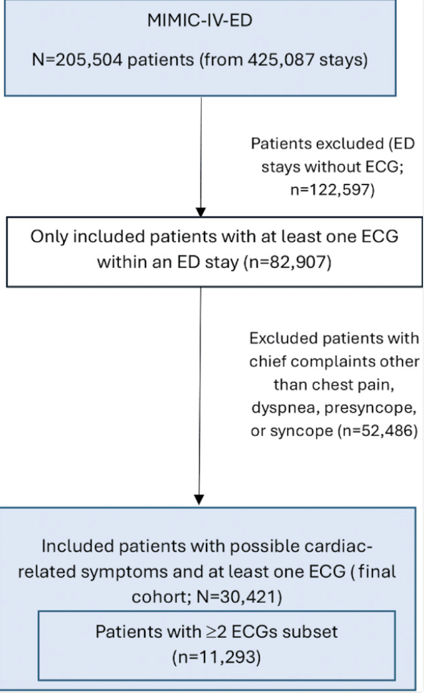
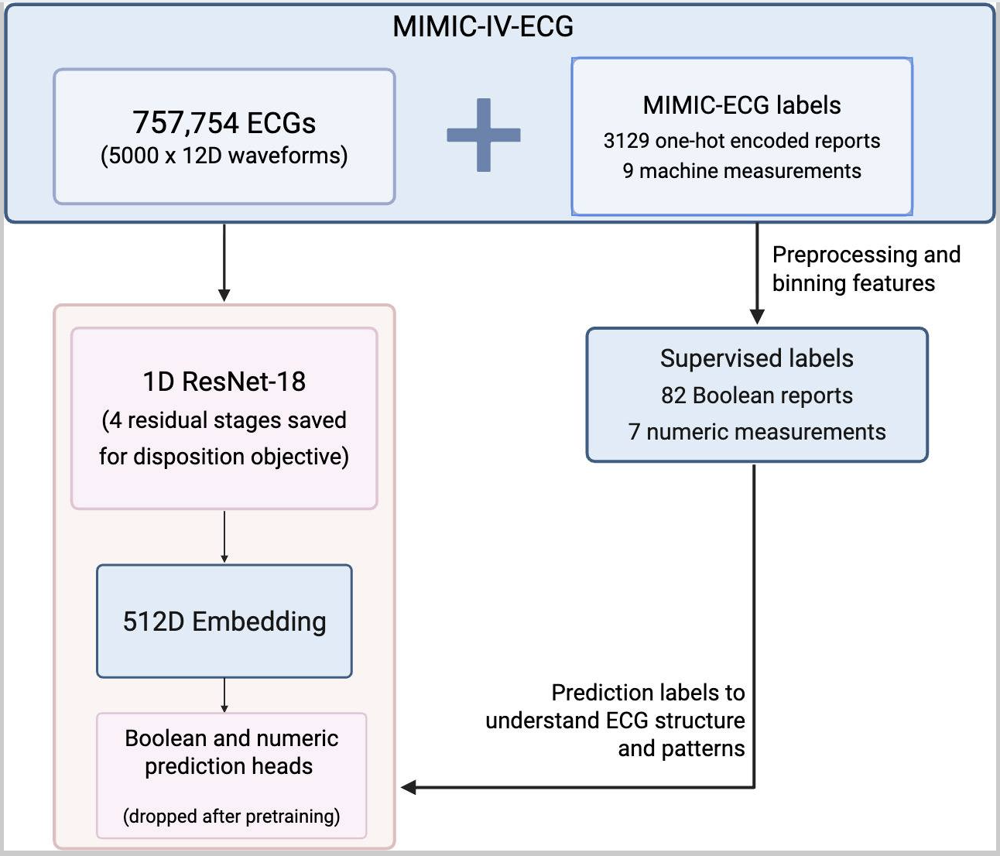
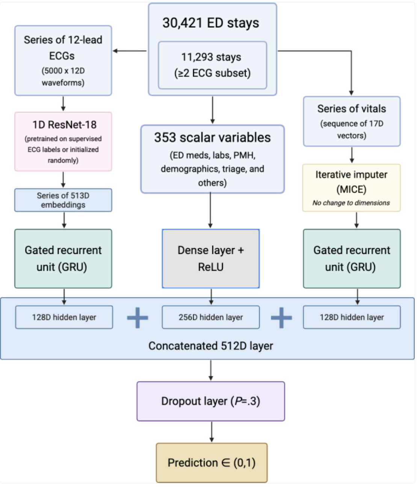
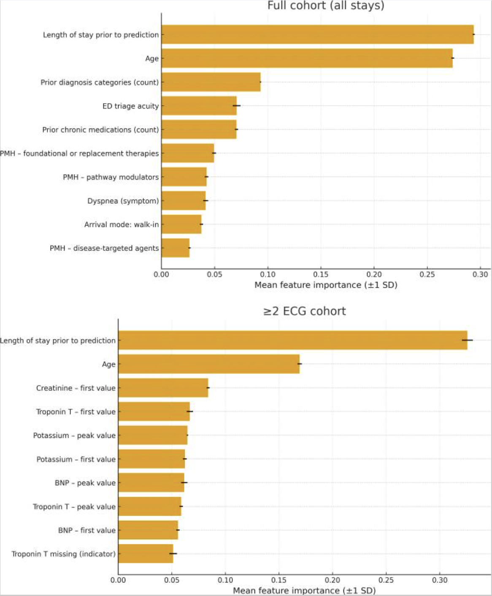

<div align="center">
<h1>Serial 12-Lead ECG–Based Deep-Learning Model for Hospital Admission Prediction in Emergency Department Cardiac Presentations</h1>
<p>
  <a href="https://doi.org/10.2196/80569"></a>
  <a href="https://doi.org/10.2196/80569"></a>
  <a href="https://pmc.ncbi.nlm.nih.gov/articles/PMC12533930/"></a>
  <a href="https://physionet.org/content/mimiciv/3.1/"></a>
</p>
<p>
  <a href="https://www.linkedin.com/in/arda-altintepe-584b5b306/">Arda Altintepe</a><sup>1</sup> &nbsp;·&nbsp;
  <a href="https://scholar.google.com/citations?user=YOUR_ID">Kutsev Bengisu Ozyoruk</a><sup>2,*</sup>
</p>
<p>
  <sup>1</sup> Horace Mann School, New York, NY, USA<br>
  <sup>2</sup> Department of Radiology and Imaging Sciences, Emory University School of Medicine, Atlanta, GA, USA
</p>
<p><em>JMIR Cardio</em>, 2025</p>
</div>

---

## Overview

Emergency department (ED) crowding is a major contributor to reduced quality of care, and early prediction of patient disposition—admission versus discharge—can help streamline patient flow. Patients presenting with chest pain, dyspnea, syncope, or presyncope frequently undergo serial ECGs and vital sign measurements during their ED evaluation, yet existing risk stratification tools rely on single-time-point data and often do not incorporate raw ECG waveforms.

This repository provides a **fully open-source, reproducible pipeline** for predicting hospital admission in real time using a multimodal deep-learning model that fuses:

- **Serial 12-lead ECG waveforms** encoded by a ResNet-18 backbone
- **Sequential vital signs** modeled with a gated recurrent unit (GRU)
- **Static clinical features** including demographics, triage acuity, lab results, ED medications, and past medical history

The model is built entirely on the publicly available [MIMIC-IV](https://physionet.org/content/mimiciv/3.1/) ecosystem (MIMIC-IV, MIMIC-IV-ED, MIMIC-IV-ECG).

---

## Method

### 1. Study Cohort

Adults presenting to the ED with chief complaints of chest pain, dyspnea, syncope, or presyncope and at least one 12-lead ECG during their stay were included from the MIMIC-IV-ED module. After filtering, the final cohort comprised **30,421 unique patients** (all stays with ≥1 ECG) with a subset of **11,273 patients** with ≥2 ECGs per encounter. The admission rate was 43.2% in the full cohort.

<p align="center">
  
</p>

**Figure 1** — Flowchart of study population. Starting from 82,907 patients with mapped ECGs in MIMIC-IV-ED, the cohort is filtered to cardiac-related chief complaints, valid dispositions, and one stay per patient.

### 2. Feature Extraction

**Static features (353 total):** Demographics and triage data (age, sex, acuity, arrival mode, chief complaint), ED lab results (Troponin T, creatinine, lactate, BNP, etc., each with first value, peak value, abnormal flag, and missing flag), 38 binary ED medication features, 253 prior ICD diagnosis bins, 7 prior medication groups, and prior visit disposition.

**Sequential vitals:** Temperature, heart rate, respiratory rate, oxygen saturation, systolic/diastolic blood pressure, and pain, charted before the final ECG. Missing vitals were imputed using a Bayesian regression formula fit on the training set.

**ECG waveforms:** Raw 12-lead recordings (500 Hz, 10 seconds) cleaned with NeuroKit2 and encoded by a 1D ResNet-18 into 512-dimensional feature vectors.

### 3. Supervised Pretraining (Transfer Learning)

The ResNet-18 ECG encoder was pretrained on the full MIMIC-IV-ECG dataset (757,754 recordings) to predict machine measurements (RR interval, QRS axis, T-axis, etc.) and 82 one-hot-encoded machine-generated report labels (e.g., "Atrial Fibrillation," "ST-elevation," "Normal ECG"). This supervised pretraining captures general waveform structure before fine-tuning on the disposition task.

<p align="center">
  
</p>

**Figure 2** — Flowchart of the supervised pretraining workflow. The full MIMIC-IV-ECG dataset is used to train a ResNet-18 to predict quantitative ECG measurements and categorical report labels, producing a pretrained encoder for transfer to the hospitalization prediction task.

### 4. Multimodal Fusion Model

Two independent single-layer GRUs summarize the ECG embedding sequence (up to 6 ECGs) and the vital signs sequence (up to 10 chartings), each producing a 128-dimensional hidden state. These are concatenated with a 256-dimensional projection of the static features and passed through a dropout layer and single-neuron sigmoid head to produce an admission probability.

<p align="center">
  
</p>

**Figure 3** — Architecture of the multimodal fusion model. Serial ECG waveforms and sequential vitals are summarized by separate GRUs, concatenated with projected static features, and passed through a fully connected head to predict hospital admission.

### 5. Evaluation

All models were evaluated with **stratified 5-fold cross-validation** using identical splits. Baselines include an ECG-only model (same encoder + GRU, no tabular or vitals data) and a tabular-only random forest on the 353 static features. Pairwise AUROC differences were tested with the DeLong method.

---

## Results

The multimodal model predicted disposition after the final ECG, a **median of 0.3 hours (IQR 0.2–5.3) after triage** and **4.6 hours (IQR 2.7–7.3) before ED departure** in the full cohort.

### Classification Performance

| Cohort | Model | AUROC | AUPRC |
|--------|-------|-------|-------|
| All stays (n=30,421) | ECG-only | 0.852 | 0.813 |
| All stays | Tabular (RF) | 0.886 | 0.849 |
| All stays | **Multimodal** | **0.911** | **0.889** |
| ≥2 ECG stays (n=11,273) | ECG-only | 0.859 | 0.794 |
| ≥2 ECG stays | Tabular (RF) | 0.911 | 0.865 |
| ≥2 ECG stays | **Multimodal** | **0.924** | **0.889** |

The multimodal model significantly outperformed both baselines in each cohort (paired DeLong P<.001). The largest performance gap between multimodal and tabular models appeared in the all-stays cohort, where predictions were made early and static data were sparse.

<p align="center">
  
</p>

**Figure 4** — Mean feature importance across 5 folds for the tabular random forest model in both cohorts. Length of stay prior to prediction and age are the most important features in both cohorts. Troponin features dominate in the ≥2 ECG subset, where lab results are less frequently missing due to the longer observation window.

---

## Repository Structure

| Directory / File | Description |
|------------------|-------------|
| `Preprocessing/main.py` | Main cohort construction from raw MIMIC-IV files; outputs `final_ecgs.csv` |
| `Preprocessing/EDmeds.py` | Adds 38 binary ED medication features (Pyxis → ETC grouping) |
| `Preprocessing/PMH_diagnoses.py` | Adds 253 prior ICD diagnosis bins (CCS/CCSR categories) |
| `Preprocessing/PMH_meds.py` | Adds 7 prior medication group features (ETC codes, past year) |
| `Preprocessing/labs.py` | Adds 36 lab features (9 labs × 4 columns: first, peak, abnormal, missing) |
| `Preprocessing/vitals.py` | Creates `vitals_long_cleaned.csv` with sequential vitals before prediction cutoff |
| `Pretraining/Preprocessing.py` | Preprocessing for the full MIMIC-IV-ECG pretraining dataset |
| `Pretraining/Pretrain.py` | ResNet-18 supervised pretraining on machine measurements + reports |
| `Pretraining/Pretrained_model.py` | Pretrained model architecture for reference or import |
| `Pretraining/pretrained_model.pth` | Saved pretrained ResNet-18 weights (transfer to disposition task) |
| `Models/ECG only/GRU_ecg.py` | ECG-only GRU model: ResNet-18 encoder + sequential GRU, no tabular data |
| `Models/Tabular/train.py` | Random forest baseline on 353 static clinical features |
| `Models/Multimodal/train.py` | Multimodal fusion: ECG GRU + vitals GRU + static features → admission prediction |
| `Models/*/Metrics - All Stays/` | Per-fold metrics, ROC curves, and CV summaries for the full cohort |
| `Models/*/Metrics - Multi-ECG Stays/` | Per-fold metrics, ROC curves, and CV summaries for the ≥2 ECG subset |
| `Figures/` | Figures from the published paper (numbered to match the paper) |

> **Note on figures:** All figures in `Figures/` use the same numbering as the published paper (e.g., `Figure1.png` corresponds to Figure 1 in the paper) for easy cross-referencing.

---

## Usage

### Prerequisites

All data are obtained from the publicly available [MIMIC-IV](https://physionet.org/content/mimiciv/3.1/) ecosystem on PhysioNet. Access requires completing a data-use agreement. The following modules are needed:

- [MIMIC-IV v3.1](https://physionet.org/content/mimiciv/3.1/) — hospital admissions, diagnoses, patients, prescriptions
- [MIMIC-IV-ED v2.2](https://physionet.org/content/mimic-iv-ed/2.2/) — ED stays, triage, vitals, pyxis medications
- [MIMIC-IV-ECG v1.0](https://physionet.org/content/mimic-iv-ecg/1.0/) — 12-lead ECG waveforms, machine measurements, and reports

### Python Dependencies

```
torch, numpy, pandas, scikit-learn, neurokit2, wfdb, tqdm, matplotlib
```

### Running the Pipeline

**1. Preprocessing** — Run scripts in `Preprocessing/` to build the cohort and extract static and sequential features from raw MIMIC-IV CSVs:
   - `main.py` → `final_ecgs.csv`
   - Then run `EDmeds.py`, `PMH_diagnoses.py`, `PMH_meds.py`, `labs.py`, and `vitals.py` to augment with additional features.

**2. Pretraining (optional)** — To reproduce the pretrained ECG encoder:
   - `Pretraining/Preprocessing.py` → `pretraining_ecgs.csv`
   - `Pretraining/Pretrain.py` → `pretrained_model.pth`
   - Alternatively, use the provided `pretrained_model.pth` weights directly.

**3. Model Training & Evaluation** — Each model directory under `Models/` contains a self-contained training script with stratified 5-fold cross-validation:
   - `Models/ECG only/GRU_ecg.py` — ECG-only baseline
   - `Models/Tabular/train.py` — Random forest baseline
   - `Models/Multimodal/train.py` — Multimodal fusion model

> **Note:** Because MIMIC-IV is distributed under a data-use agreement, raw or preprocessed patient-level data cannot be redistributed in this repository. Researchers can obtain the same data free of charge by completing the [PhysioNet credentialing process](https://physionet.org/settings/credentialing/).

---

## Contact

For questions or issues, please contact [arda.altintepe08@gmail.com].

---

## Citation

```bibtex
@article{altintepe2025serial,
  author    = {Altintepe, Arda and Ozyoruk, Kutsev Bengisu},
  title     = {Serial 12-Lead Electrocardiogram–Based Deep-Learning Model for Hospital Admission Prediction in Emergency Department Cardiac Presentations: Retrospective Cohort Study},
  journal   = {JMIR Cardio},
  volume    = {9},
  pages     = {e80569},
  year      = {2025},
  doi       = {10.2196/80569},
  pmid      = {41105881},
  pmcid     = {PMC12533930}
}
```
